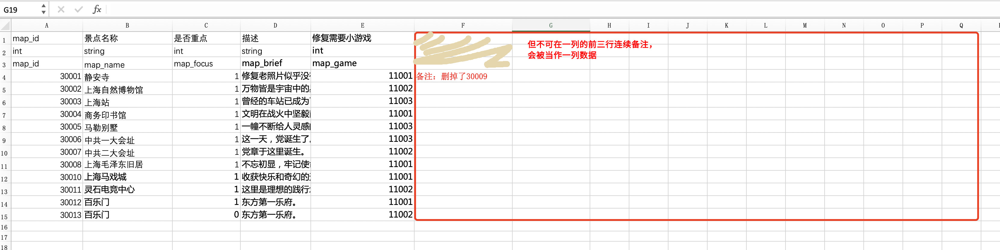

### xlsx2json
> 让excel支持复杂的json格式, 将xlsx文件转成json。

### 使用说明
* 目前只支持.xlsx格式，不支持.xls格式。
* 本项目是基于nodejs的，所以需要先安装nodejs环境。
* 执行命令
```bash
# Go into the repository
cd xlsx2json
# Install dependencies
npm install
```

* 配置config.json
```javascript
{
    "xlsx": {
        /**
         * 表头所在的行
         * TIPS: 第一行字段中文描述，第二行字段类型，第三行字段名称(默认导出array，若以#开头则导出hash格式);
         */
        "head": 3,

        /**
         * xlsx文件所在的目录
         * glob配置风格
         */
        "src": "./excel/**/[^~$]*.xlsx",

        /**
         * 导出的json存放的位置
         */
        "dest": "./json"
    },

    /**
     * 是否导出d.ts（for typescript）
     * 一张表格只导出一个d.ts文件
     * true:生成d.ts，false:不生成
     */
    "ts":false,

    "json": {
      /**
       * 导出的json是否需要压缩
       * true:压缩，false:不压缩(便于阅读的格式)
       */
      "uglify": false
    }
}
```
* 执行`./export.sh|export.bat`即可将`./excel/*.xlsx` 文件导成json并存放到 `./json` 下。json名字以excel的sheet名字命名。

* 补充(一般用不上)：
    * 执行`node index.js -h` 查看使用帮助。
    * 命令行传参方式使用：执行 node `index.js --help` 查看。

#### 示例1 基本功能
输出如下(因为设置了`#`列，输出`JsonHash`格式，如果无`#`列则输出数组格式)：

```json
{
  "1111": {
    "id": 1111,
    "name": "风暴之灵",
    "slogen": ["风暴之灵已走远","在这场风暴里没有安全的港湾啊，昆卡！"],
    "skill": {
      "R": {
        "name": "残影",
        "冷却时间": [3.5,3.5,3.5,3.5],
        "作用范围": 260,
        "主动技能": true,
        "levels": [
          {"level": 1,"damage": 140,"mana": 70},
          {"level": 2,"damage": 180,"mana": 80}
        ]
      },
      "E": {
        "name": "电子漩涡",
        "冷却时间": [21,20,19,18],
        "主动技能": true,
        "levels": [
          {"level": 1,"time": 1,"cost": 100,"distance": 100},
          {"level": 2,"time": 1.5,"cost": 110,"distance": 150}
        ]
      }
    }
  },
  "1112": {
    "id": 1112,
    "name": "幽鬼",
    "slogen": null,
    "skill": null
  }
}
```

如果将第一列的`#id`换成`id`则会输出`JsonArray`格式：

```json
[
  {
    "id": "1111",
    "name": "风暴之灵",
    "slogen": ["风暴之灵已走远","在这场风暴里没有安全的港湾啊，昆卡！"],
    "skill": {
      "R": {
        "name": "残影",
        "冷却时间": [3.5,3.5,3.5,3.5],
        "作用范围": 260,
        "主动技能": true,
        "levels": [
          {"level": 1,"damage": 140,"mana": 70},
          {"level": 2,"damage": 180,"mana": 80}
        ]
      },
      "E": {
        "name": "电子漩涡",
        "冷却时间": [21,20,19,18],
        "主动技能": true,
        "levels": [
          {"level": 1,"time": 1,"cost": 100,"distance": 100},
          {"level": 2,"time": 1.5,"cost": 110,"distance": 150}
        ]
      }
    }
  },
   {
    "id": "1112",
    "name": "幽鬼",
    "slogen": null,
    "skill": null
  }
]
```

### 示例2 复杂表格拆分(参考./excel/master-slave.xlsx)


如果一个表格某一列是`object[]` 或者`object{}`类型的时候，防止表格过于复杂，可将主表拆分。如上图所示。

比如上图中的 `表1`中 `boss object{}`和 `reward object[]`列比较复杂，可以将之拆为三个表：`表1、2、3`，将`表1`中的 `boss object{}`拆成`表2`，`表1`中的`reward object[]`拆成表3。`表1`为主表，`表2、3`为从表。


### 支持以下数据类型

* `int` int类型。
* `float` float类型。
* `long` long类型。
* `boolean`  布尔。
* `string` 字符串。
* `date` 日期类型。
* `object `对象，同JS对象一致。
* `array`  数组，同JS数组一致。
* `int[]` int数组类型。
* `float[]` float数组类型。
* `string[]` 字符串数组。


### 表头规则

* 明确声明数据类型。
* 字符串类型：命名形式 `string` 。
* 日期类型：`date` 。日期格式要符合标准日期格式。比如`YYYY/M/D H:m:s` or `YYYY/M/D` 等等。
* 布尔类型：命名形式 `bool` 。
* 数组：命名形式  `[]`。
* 对象：命名形式 `{}`。
* 列名字以`!`开头则不导出此列。
* slave表中必须要有`master`列。


### sheet规则

- sheet名字以`！`开头则不导出此表。
- 主表的名字 `主表名字#master`。
- 从表的名字 `从表名字@主表名字`，主表必须在从表的前面。


### 主从表相关规则(master/slave)

- master表必须是hash类型，即必须有以`#`开头列。
- slave表名字 `从表名字@主表名字`，master表的顺序必须在slave表的前面。
- slave表中必须要有`master`列。
- 如果将master表中的`{}列`拆分，则slave表中应有以`#master`开头列，值为主表中的唯一key。
- 如果将master表中的`[]列`拆分，则slave表中应有以`master`开头列，值为主表中的唯一key。
- 具体请看示例`./excel/master-salve.xlsx`。

### 表备注规则
* 可在表内容列之后不超过内容行的任何区域备注，如下红框区域：


### 注意事项

* 解析excel字符串的时候用到`eval()`函数，如果生产环境下excel数据来自用户输入，会有注入风险请慎用。
* 关键符号都是英文半角符号，和JSON要求一致。
* 对象写法同JavaScript中对象写法一致(不会JS的同学可理解为JSON的key不需要双引号其他和JSON一样)。
* 数组写法同JavaScript中数组写法一致(不会JS的同学可理解为JSON的key不需要双引号其他和JSON一样)。
* 如果导出的JSON文件尾行出现value都是null的数据，可能是因为excel中数据没删除干净，看控制台打印的行数据条目数和实际符不符合可判定。
